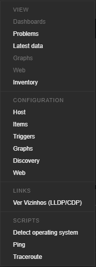
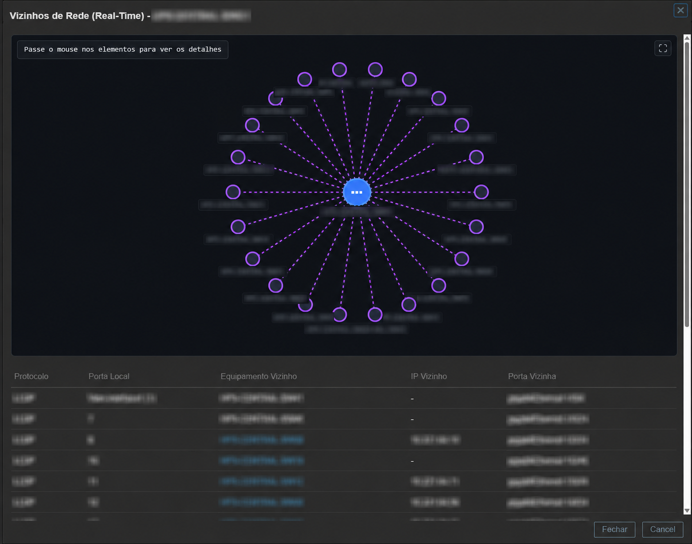

# Discovery Neighbors Popup (Zabbix Module)

[](https://www.zabbix.com/)
[](https://www.php.net/)
[](LICENSE)

**Discovery Neighbors Popup** is a native Zabbix frontend module that extends the host context menu to display, in real-time, the network neighbors connected to the host using link-discovery protocols (**LLDP**, **CDP**, and **EDP**).

The module performs on-demand SNMP queries directly from the Zabbix web server to the network equipment, generating a detailed connection table alongside an **interactive SVG-based topology visualization**.

---

## 📷 Screenshots

> *Tip: Create a `screenshots` folder in your repository and replace these placeholders with your actual screenshots.*

### Host Context Menu Integration

*Integration with the native Zabbix context menu (under Links).*

### Interactive Topology & Table View

*Interactive SVG graph showing LLDP/CDP/EDP neighbors, color-coded, with detailed connection mapping.*

---

## 🚀 Key Features

- **Real-Time Queries:** Fetches data directly from the network device via SNMP on-demand, ensuring the topology reflects the current state at the moment of the click.
- **Multi-Protocol Support:** Discovers network neighbors using **LLDP** (IEEE 802.1AB), **CDP** (Cisco Discovery Protocol), and **EDP** (Extreme Discovery Protocol).
- **Interactive SVG Topology Map:**
  - Lightweight dynamic graph rendered entirely on the client side (no heavy external library dependencies).
  - Clear color coding per protocol (Purple for LLDP, Orange for CDP, Red for EDP).
  - Highlighting and focus effects (hovering over lines/nodes dims other elements and highlights the exact local and remote ports).
  - **Fullscreen** support to inspect high-density network links.
- **Smart Zabbix Host Mapping:**
  - The module automatically queries Zabbix to see if the resolved name or IP of any discovered neighbor matches a registered Host.
  - If a match is found, it replaces the name with the Host's Zabbix visible name and adds a **clickable link** to navigate directly to that host's context menu.
- **Recursive Ad-Hoc Discovery:**
  - Click on any neighbor classified as a distribution device (switches or routers) to query its neighbors recursively using its IP address, even if the device is not registered in Zabbix.
- **Automatic Macro Resolution:**
  - Resolves Zabbix user macros (e.g., `{$SNMP_COMMUNITY}`), dynamically fetching SNMP community strings inherited from templates or configured directly on the host level.

---

## 📋 Prerequisites

1. **Zabbix:** Version 7.0 LTS or higher (requires frontend support for Manifest v2.0).
2. **PHP SNMP Extension:** The `php-snmp` extension must be installed and active in the PHP environment running the Zabbix frontend (Apache/Nginx/PHP-FPM).
   - On Debian/Ubuntu: `apt-get install php-snmp`
   - On RHEL/CentOS: `dnf install php-snmp`
3. **Network Devices Configuration:** Devices must have SNMP (v1 or v2c) enabled and discovery protocols (LLDP/CDP/EDP) active on the interfaces.

---

## 🔧 Installation

1. Navigate to the Zabbix frontend modules directory (usually `ui/modules/` or `/usr/share/zabbix/modules/`):
   ```bash
   cd /usr/share/zabbix/modules/
   ```

2. Clone this repository into a folder named `discovery_neighbors_popup`:
   ```bash
   git clone https://github.com/your-username/discovery_neighbors_popup.git discovery_neighbors_popup
   ```

3. Ensure the web server user (e.g., `www-data` or `nginx`) has read permissions for the module directory.

4. Log in to Zabbix frontend with an Administrator account:
   - Go to **Administration** ➔ **General** ➔ **Modules**.
   - Click **Scan directory** to detect the module.
   - Locate the **Discovery Neighbors Popup** module and click **Disabled** to change its status to **Enabled**.

---

## ⚙️ How to Use

1. Navigate to any page in Zabbix displaying Host links (e.g., **Monitoring** ➔ **Hosts** or a **Dashboard**).
2. Click on the name of a Host configured with an SNMP interface.
3. In the context popup menu, under the **Links** section, click the new option **Ver Vizinhos (LLDP/CDP)**.
4. A modal window (overlay) will open showing the topology map and connections.
5. Hover over links or nodes to inspect local and remote ports.
6. Click on highlighted nodes to navigate to that host in Zabbix or trigger a recursive ad-hoc scan on that neighbor's IP.

---

## 🛡️ Access Control (Permissions)

Access to this module and the execution of its SNMP scans are integrated with Zabbix's native permission system (**User Roles**):
- **Role-Based Activation:** Zabbix administrators can enable or disable the module specifically for each User Role. If the module is unchecked in the role configuration, Zabbix will block any attempts to open the topology overlay.
- **UI Access Requirements:** Internally, the module checks if the user's role has read permissions for Zabbix monitoring interfaces (*Monitoring -> Hosts* or *Monitoring -> Problems*).

---

## 🔒 Security Considerations

Before deploying this module in your environment, please review these key points:

1. **No Hardcoded Credentials:** The module is secure by design and does not store any passwords, SNMP community strings, or API tokens in the codebase. It dynamically resolves SNMP communities and permissions using the current logged-in user session and native Zabbix helper APIs.
2. **Ad-Hoc Queries via IP (Potential SSRF):**
   - The recursive discovery feature allows users with monitoring permissions to scan arbitrary IP addresses via SNMP from the Zabbix web server.
   - **Access Control Mitigation:** You can restrict which users can perform these queries by configuring **User Roles** in Zabbix (disabling the module or limiting monitoring access for untrusted roles).
3. **No Debug Logs in Production:** For security and privacy, debug logging to files or to the web server's error log is completely disabled. No sensitive data, such as IP addresses or resolved SNMP community strings, is written to disk.

---

## 📄 License

This project is licensed under the MIT License. See the [LICENSE](LICENSE) file for details.

---

**Developed by:** [Peterson Basso](https://github.com/petersonbasso)
